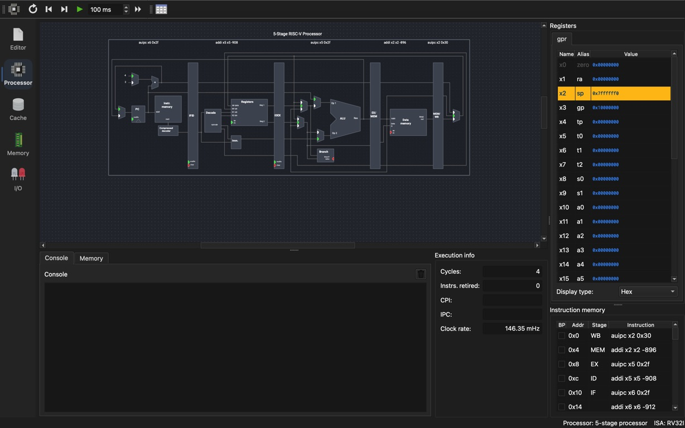
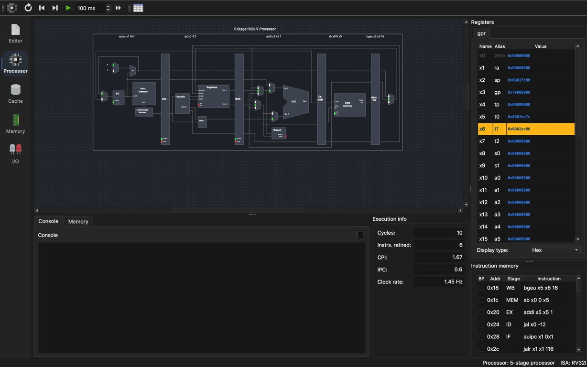
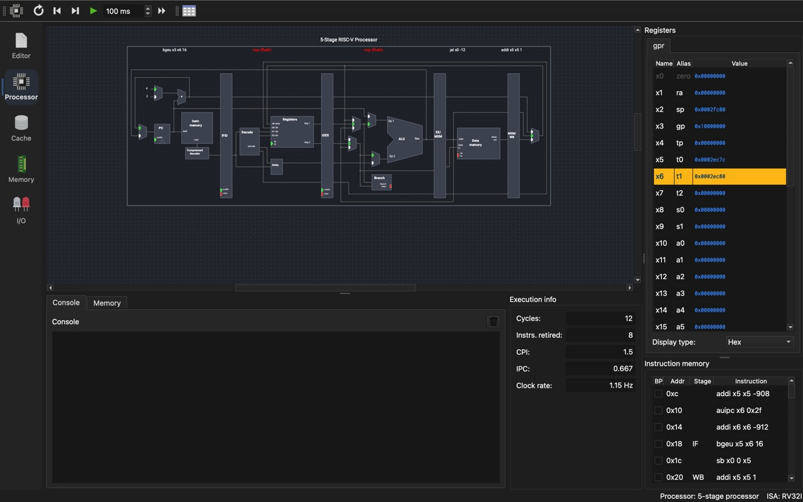
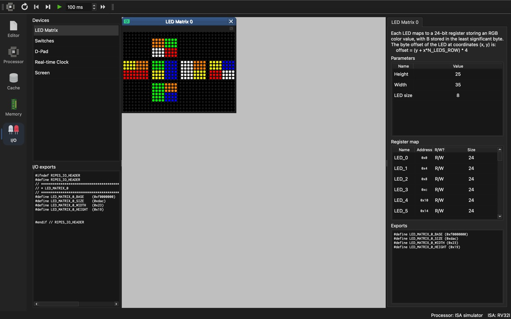
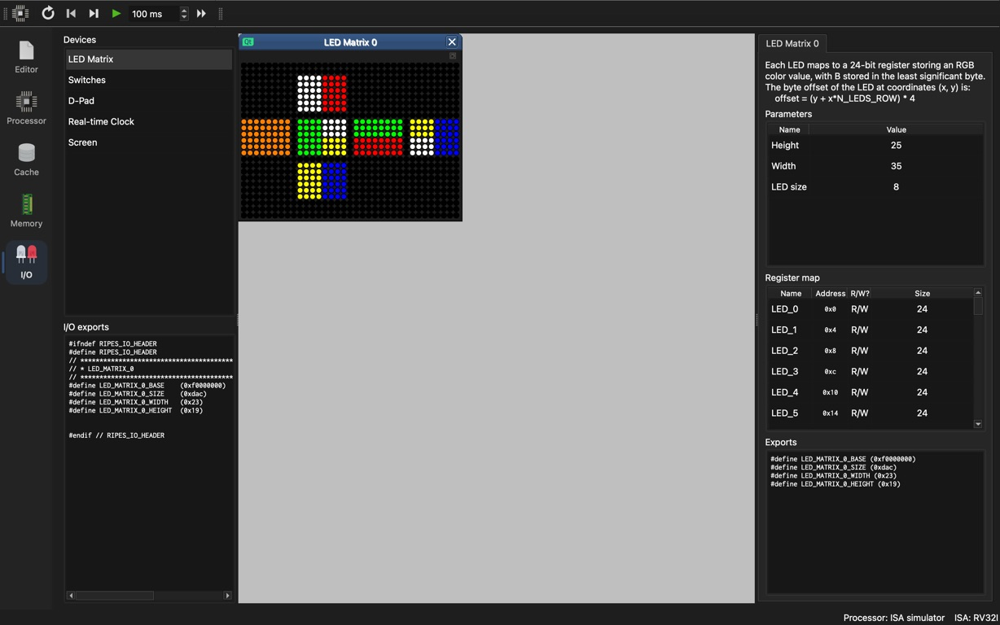
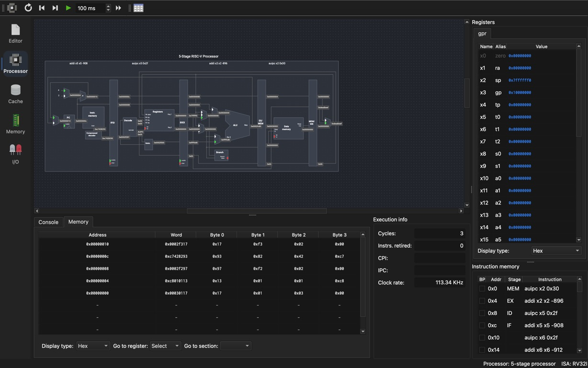
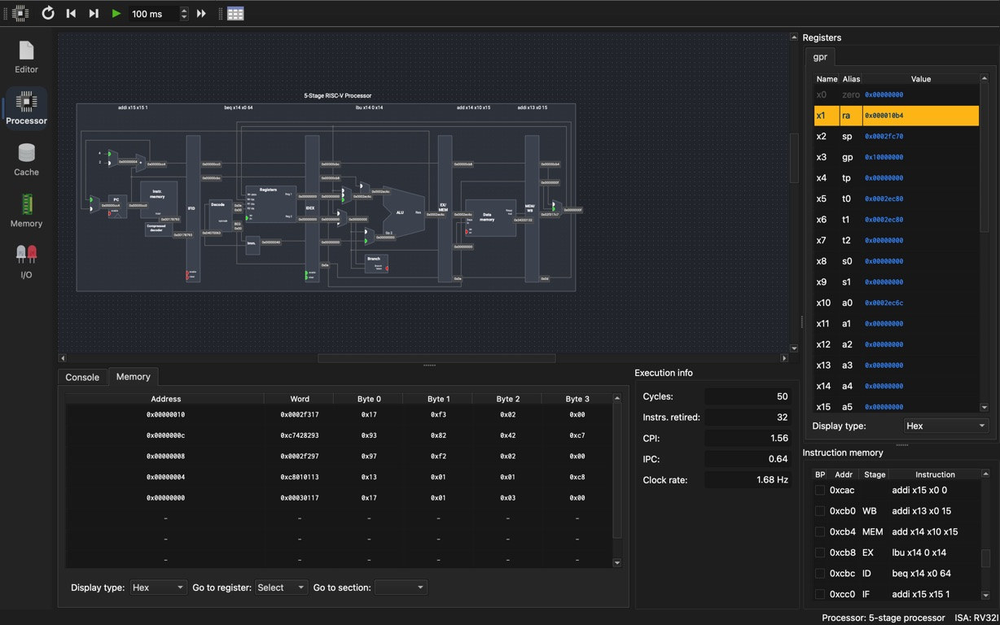
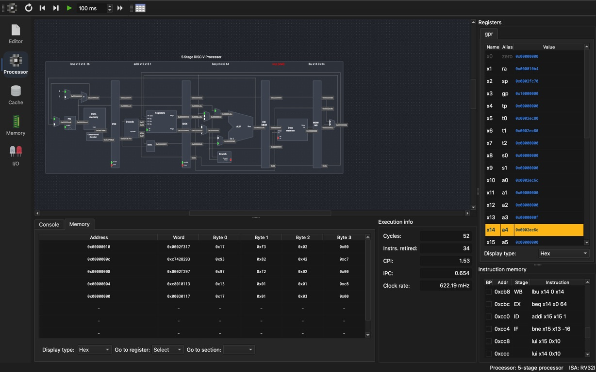

# Ripes GUI observations (partial)

Observed on 2026-10-07 with the 5-stage RV32I processor after selecting `solver7_optimization_led.elf` from the project directory. These are actual GUI captures, not CLI-generated diagrams.

## Five stages

At cycle 4: IF `0x10`, ID `0x0c`, EX `0x08`, MEM `0x04`, WB `0x00`. This shows five different startup instructions occupying the five stages simultaneously.

## Memory write enable

At cycle 10, `sb x0, 0(x5)` at `0x1c` is in MEM and the data-memory write-enable indicator is green. Register x5 is `0x2ec7c`; x6 is `0x2ec80`. This captures the BSS-clear store. A before/after memory-content capture is still pending.

## Control-hazard flush

At cycle 12, after `jal x0, -12` at `0x24`, IF has returned to `0x18`; ID and EX display red `nop (flush)` labels. The younger sequential instructions were flushed.

## Remaining evidence

Before/after memory contents and the initial LED GUI capture plus consecutive-move verification remain incomplete. Forwarding and load-use-stall captures are included below. Intermediate and solved LED captures are included below. This page does not claim completion of the GUI requirements.

## Actual LED GUI playback

The LED Matrix was added in Ripes on 2026-10-08. Its exported base is `0xf0000000`, width `0x23` (35), and height `0x19` (25), matching `solver7_gui.elf`. Playback used the RV32I ISA simulator; M and C were disabled. Execution was paused for screenshots.

The two intermediate captures show different color arrangements; the solved capture shows six uniformly colored faces. These samples establish actual peripheral output and changing frames, but do not yet establish each consecutive move, the initial input frame, or an indexed correspondence between screenshots and replay steps.

## Forwarding and load-use stall (2026-10-08)

These observations use the renderer-off ELF and the standard five-stage processor with forwarding and hazard detection, with M/C disabled. Signal values are enabled in the View menu.

At cycle 3, `auipc x2,0x30` is in MEM and its dependent `addi x2,x2,-896` is in EX. The register file still shows the initial sp (`0x7ffffff0`); the forwarded AUIPC result (`0x30000`) supplies the dependent arithmetic before writeback.

At cycle 50, `lbu x14,0(x14)` (`0xcb8`) is in EX and `beq x14,x0,64` (`0xcbc`) is in ID. The dependent branch needs the loaded value; PC and IF/ID enable indicators are red.

At cycle 52, the load is in WB, the branch has advanced to EX, and a red `nop (stall)` bubble is visible in MEM. This is direct evidence of the inserted load-use bubble. The loaded input byte can now feed the branch through forwarding.
