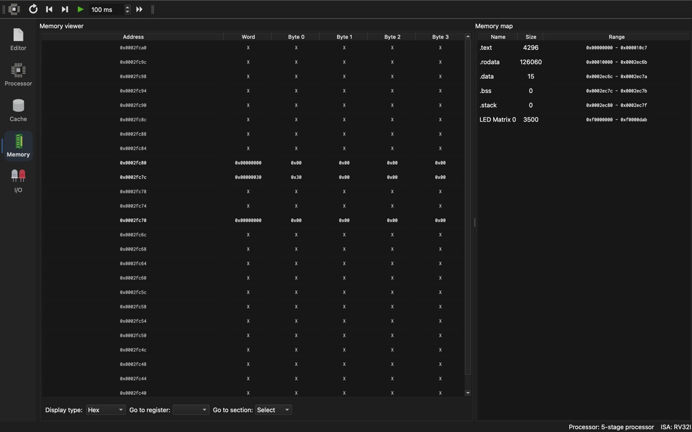
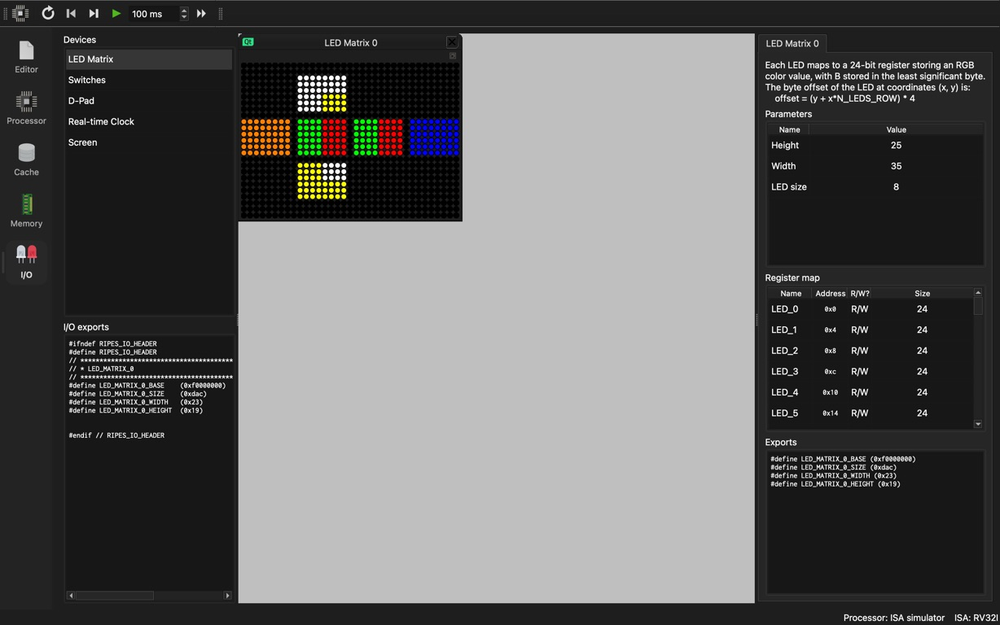
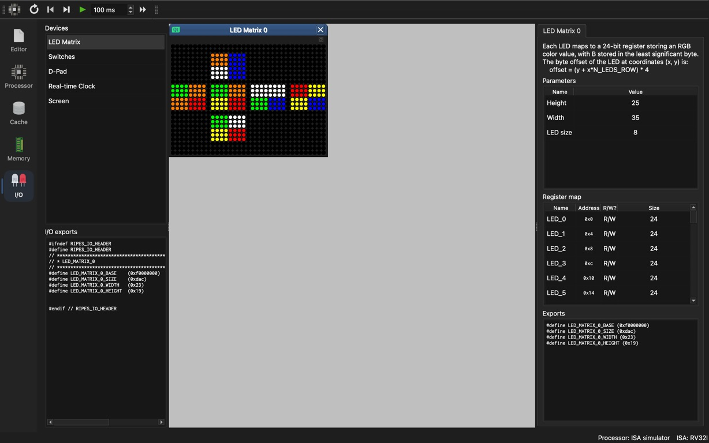
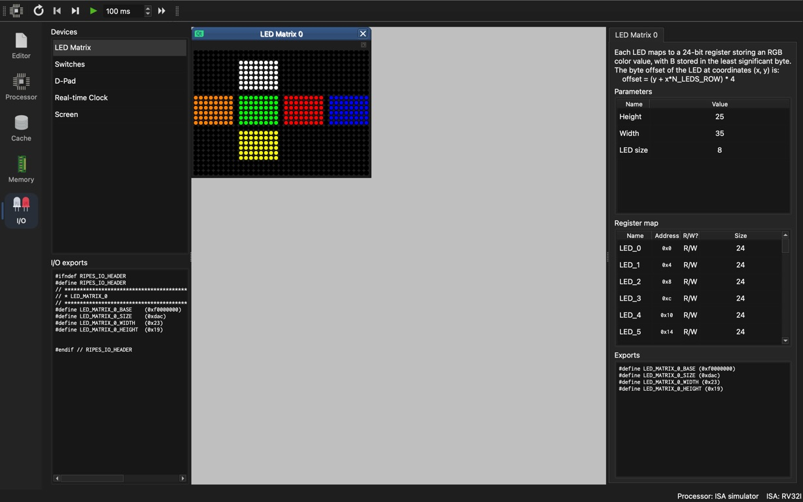

# Ripes GUI observations

Observed on 2026-10-07 with the 5-stage RV32I processor after selecting `solver7_optimization_led.elf` from the project directory. These are actual GUI captures, not CLI-generated diagrams.

## Five stages

At cycle 4: IF `0x10`, ID `0x0c`, EX `0x08`, MEM `0x04`, WB `0x00`. This shows five different startup instructions occupying the five stages simultaneously.

## Memory write enable

At cycle 10, `sb x0, 0(x5)` at `0x1c` is in MEM and the data-memory write-enable indicator is green. Register x5 is `0x2ec7c`; x6 is `0x2ec80`. This captures the BSS-clear store. A before/after memory-content capture is still pending.

## Control-hazard flush

At cycle 12, after `jal x0, -12` at `0x24`, IF has returned to `0x18`; ID and EX display red `nop (flush)` labels. The younger sequential instructions were flushed.

## Completion status

The requested GUI evidence is complete: final renderer-off five-stage pipeline stages, write enable, forwarding, load-use stall, flush and stack-memory changes; and final GUI ELF initial state plus all 11 consecutive redraws ending solved. These are AI-assisted observations and do not replace student-owned analysis or establish completion of unrelated assignment requirements.

## Actual LED GUI playback

The LED Matrix was added in Ripes on 2026-10-08. Its exported base is `0xf0000000`, width `0x23` (35), and height `0x19` (25), matching `solver7_gui.elf`. Playback used the RV32I ISA simulator; M and C were disabled. Execution was paused for screenshots.

The two intermediate captures show different color arrangements; the solved capture shows six uniformly colored faces. These earlier unindexed samples are supplemented by the complete consecutive sequence below.

## Forwarding and load-use stall (2026-10-08)

These observations use the renderer-off ELF and the standard five-stage processor with forwarding and hazard detection, with M/C disabled. Signal values are enabled in the View menu.

At cycle 3, `auipc x2,0x30` is in MEM and its dependent `addi x2,x2,-896` is in EX. The register file still shows the initial sp (`0x7ffffff0`); the forwarded AUIPC result (`0x30000`) supplies the dependent arithmetic before writeback.

At cycle 50, `lbu x14,0(x14)` (`0xcb8`) is in EX and `beq x14,x0,64` (`0xcbc`) is in ID. The dependent branch needs the loaded value; PC and IF/ID enable indicators are red.

At cycle 52, the load is in WB, the branch has advanced to EX, and a red `nop (stall)` bubble is visible in MEM. This is direct evidence of the inserted load-use bubble. The loaded input byte can now feed the branch through forwarding.

## Stack write: before and after

Using reverse clocks from cycle 52, execution was returned to cycle 43, before the MEM-stage store took effect. One forward clock then executed `sw ra,12(sp)` at `0x10a8`. With `sp=0x2fc70`, the destination is `0x2fc7c`. The word changed from `0x00000000` to `0x00000030`; bytes are `30 00 00 00`, demonstrating little-endian storage of the return address. The memory-map panel's section sizes are Ripes display values and are not used as the static-memory accounting for the submission.

## Complete consecutive LED sequence

The unmodified `solver7_gui.elf` ran on the RV32I ISA simulator with a breakpoint at `0x1128`, immediately after `cube_led_write` returns. The first breakpoint was reached after 15,164,304 retired instructions. At each stop, one F5 advanced past the breakpoint and F8 continued to the next complete redraw. No reset or skipped frame occurred between steps 0–11. The processor was stopped at the final frame.

Input: `21345671111111`. Moves: `R B' D2 R' B R' B' R D2 R B`.

| Step | Move just applied | Actual GUI screenshot |
| --- | --- | --- |
| 0 | Initial | [Frame 00](images/ripes-gui/led-step-00.png) |
| 1 | R | [Frame 01](images/ripes-gui/led-step-01.png) |
| 2 | B' | [Frame 02](images/ripes-gui/led-step-02.png) |
| 3 | D2 | [Frame 03](images/ripes-gui/led-step-03.png) |
| 4 | R' | [Frame 04](images/ripes-gui/led-step-04.png) |
| 5 | B | [Frame 05](images/ripes-gui/led-step-05.png) |
| 6 | R' | [Frame 06](images/ripes-gui/led-step-06.png) |
| 7 | B' | [Frame 07](images/ripes-gui/led-step-07.png) |
| 8 | R | [Frame 08](images/ripes-gui/led-step-08.png) |
| 9 | D2 | [Frame 09](images/ripes-gui/led-step-09.png) |
| 10 | R | [Frame 10](images/ripes-gui/led-step-10.png) |
| 11 | B | [Frame 11](images/ripes-gui/led-step-11.png) |

[Frame verification](images/ripes-gui/led-sequence-verification.json) reports 12/12 matches, checking all 24 facelets per frame by RGB sampling of the actual screenshots against states computed from the input and move sequence. The check uses the renderer corner convention; it verifies captured state/order rather than providing an independent proof of those conventions. Original screenshots are preserved without image edits.
